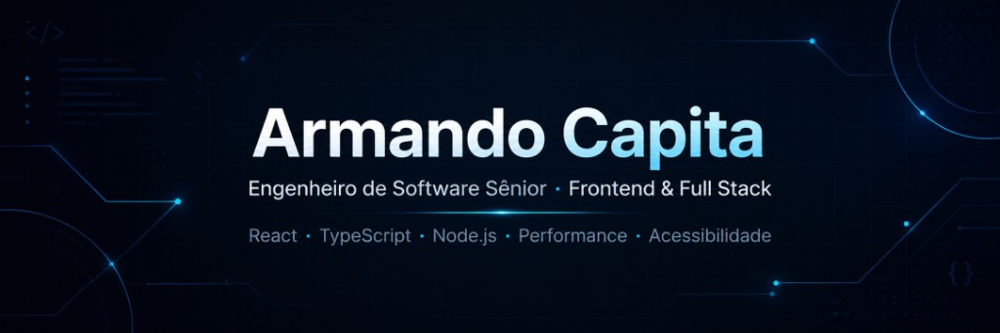

  

 

<table cellpadding="24">
  <tr>
    <td width="33%" align="center" valign="middle">
      <strong>Atualmente</strong>
        
      
        
      Frontend architecture · Performance · Acessibilidade
    </td>
    <td width="33%" align="center" valign="middle">
      <strong>Stack principal</strong>
        
      
    </td>
    <td width="33%" align="center" valign="middle">
      <strong>Foco técnico</strong>
        
      
        
      
      
      
       
      
      
      
    </td>
  </tr>
</table>

 

## Projetos em destaque

<table cellpadding="28">
  <tr>
    <td width="33%" align="center" valign="top">
      
        
      Finanças pessoais com assinatura recorrente, dashboard analítico e billing Stripe.
        
      
    </td>
    <td width="33%" align="center" valign="top">
      
        
      Rede social mobile-first com descoberta social, momentos e interação em tempo real.
        
      
    </td>
    <td width="33%" align="center" valign="top">
      
        
      Portal institucional com acessibilidade WCAG, SEO, PWA, testes automatizados e CI/CD.
        
      
    </td>
  </tr>
</table>

 

## Qualidade técnica

<table cellpadding="20">
  <tr>
    <td align="center" width="33%" valign="middle">
      
        
      <strong>Arquitetura sustentável</strong>
    </td>
    <td align="center" width="33%" valign="middle">
      
        
      <strong>Componentização clara</strong>
    </td>
    <td align="center" width="33%" valign="middle">
      
        
      <strong>Testes em fluxos críticos</strong>
    </td>
  </tr>
  <tr>
    <td align="center" valign="middle">
      
        
      <strong>CI com lint/typecheck/build</strong>
    </td>
    <td align="center" valign="middle">
      
        
      <strong>Acessibilidade e performance</strong>
    </td>
    <td align="center" valign="middle">
      
        
      <strong>Documentação objetiva</strong>
    </td>
  </tr>
</table>

 

## GitHub

  
  

 

## Contato

  
  &nbsp;&nbsp;
  

